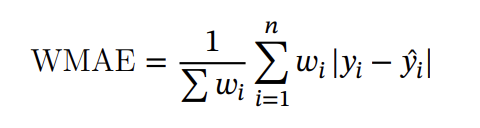

# Walmart Sales Forecasting Using Machine Learning

**Introduction**

This century has seen an outburst of data being generated as a result of
the continuous use of edge technologies. Retail giants like Walmart consider
this data as their biggest asset as this helps them predict future sales and
customers and finally helps lay out plans to generate profits and
compete with other organizations. The employment of modern technological
approaches is crucial for any organization to survive in a cutting-edge
global market and enable services that distinguish it from its
competitors.

**Purpose**

The idea behind this research is to explore the Walmart data for 45
stores and predict sales based on the available historical data and
identify whether factors like temperature, unemployment, fuel prices,
CPI etc affect the weekly sales of these stores under study. The aims is
to understand whether sales are relatively higher during holidays like
Christmas and Thanksgiving, Labor day and Super Bowl than normal days so
that stores can work on creating promotional offers that increase sales
and generate higher revenue.

Walmart runs several promotional markdown sales throughout the year on
days immediately following the prominent holidays in the United States which
are taken into consideration to determine the impact on weekly sales and
to drive resources towards such key strategic initiatives.

**Tools Used**

The analysis for this forecasting has been done using Python and Tableau
on the dataset provided by Walmart at
“*https://data.world/tommywilczek/walmart”*. For the initial EDA Python
libraries like matplotlib, seaborn, etc have been implemented. Packages
like numpy, pandas, etc. have been used for data wrangling and
manipulation.

For the models that have been trained, several packages like
‘scikit-learn’, ‘xgboost’, etc have been applied.

**Exploratory data analysis**

This includes extensive analysis for the Walmart dataset to understand
the following:

> • Identifying store as well as department-wide sales in Walmart
>
> • Identifying sales based on store size and type
>
> • Identifying how much sales increase during holidays
>
> • Correlation between the different factors that affect sales
>
> • Average sales per year
>
> • Impact on sales as per temperature, fuel price and unemployment.

Correlation testing has been performed to understand if there is a
correlation between individual factors and weekly sales and whether such
factors have any impact on sales made by Walmart.

**Data Cleaning**

Deletion of the unnamed columns that were not required for analysis. The
records with weekly sales less than 0 were removed to avoid the error
because of negative values. Temperature outliers were identified in the
data but can be ignored. Markdown columns have the null values that were
handled.

A new column was created as a markdown sum and imputed all the 5
markdown missing fields with the mean of the available column values.
This is done to ensure the errors because of non-numeric values in such
fields.

**Feature Engineering**

Considering four holiday weeks in the data, added the columns for
super_bowl, Thanksgiving, Labor_Day and Christmas. The date field was
split to get more insights about monthly, day-wise or yearly sales.
Holiday_month column was introduced to explore the sales. The holiday
months marked are February, September, November and December. Days left
for Thanksgiving and Christmas are created with the expectation that
sales will be higher before the holidays than on the exact holiday.

Numeric column scaling performed from range 0,1. Encoding of the
categorical columns like Type and IsHoliday to numeric using
OneHotEncoder.

**Methodology**

The accuracy technique used is WMAE - Weighted Mean Absolute error.

> The weights are added based on the holiday flag, if it is a holiday
> week value is taken as 5 otherwise 1. n is the result dataset size
> that is the test dataset with 84042 records.
>
> The data is split into test and train datasets based on date range.
> The ratio used is 80% for test and 20% for train data. Test data have
> records till date April 20th 2012 and Train data have
> records starting from April 20th 2012 till December 2012.
> First, the hardcoded model, K-Mean regressor is trained and below are
> the results.

- WMAE Train data = 15383.02

- WMAE Test data = 15288.6

Further training the baseline model, Linear regression algorithm
resulted in wmae as 14302.2

**Model Evaluation**

Created and trained various models to predict future sales using
different algorithms**.** The test and train data error loss and wmae
details are as follows:-

Gradient Booster seems to be the best algorithm for this data. It gives
the minimum WMAE 2886 for the predicted values. The second-best model is
the Random Forest Regression model.

Further analysed the feature importance using Random Forest regressor
and Gradient Booster algorithms. Observation was theThanksgiving,
Department, and Size have the maximum importance whereas MarkDown1,
MarkDown2, MarkDown3, MarkDown4, MarkDown5, and Temperature have the
least importance.

Hypertuned various parameters and trained the final model – gradient
Booster using the below values :-

- n_estimators = 500

- max_depth = 15

- Learning_rate = 0.4

Features were taken after removing the unimportant columns.

Results from the final model :-

> Error loss with Training set 🡪 12.58
>
> Error Loss with Test Data 🡪 1915.64
>
> WMAE 🡪 1909.18 which is the minimum of all the models tried.

The Sales predictions for all the models are stored using a common
function in different CSV files for future references and improvements.

**Conclusions**

- Store size is a great factor that affects sales; the bigger the store,
  the higher the sales. Store A still has the highest sales, followed by
  stores B and C.

- Stores 20,4 and 14 have the highest sales for Type A, and stores 10,
  23 and 18 have the highest sales for Type B.

- Departments 95, 92 and 38 generate the highest revenue for Walmart
  across all the sizes of stores. The stores with these departments will
  result in higher sales.

- Sales are the highest during the holiday season (in November and
  December month).

- Extreme hot and cold weather has a profound impact on sales and
  pleasant weather encourages higher sales.

- The gradient Booster model gave the minimum error loss and we achieved
  the WMAE of 1909.18.

- Average sales predicted is around 15K which is almost similar to the
  average of actual data.

**Limitations**

The data for the analysis comes from a limited number of Walmart stores
and is between

the years 2010 and 2012. Because of this limited history data, models
cannot be

trained as efficiently to give accurate results and predictions. It is
harder to train and tune models as an over-constrained model might
reduce the accuracy.

Additionally, the models created have been developed based on certain
assumptions like weight based on holiday flags and business conditions;
it is harder to predict the effects of certain economic or social
policies on the sales recorded by the organization. Also, consumer
buying behaviour changes over time or the policies laid down by the
management might affect the company’s revenue; these factors can have a
direct impact on sales and it is necessary to constantly study the
market trends and compare them with existing performance to create
better policies and techniques for increased profits.

**Future Work**

An important aspect of this study could be to try and understand
customer buying behaviour based on regional and departmental sales. This customer
segmentation can help Walmart create and communicate targeted messages for customers
belonging to a particular region, establishing better customer
relationships, focusing on profit-generating regions, and identifying
ways to improve services in specific regions or for specific customers.

Time series forecasting is another aspect that can be utilized (ARMA and
ARIMA modelling) to predict future sales for each of the stores and
their respective departments.

**Resources**

Random Forest Regression.
<https://levelup.gitconnected.com/random-forest-regression-209c0f354c84>

Feature Importance and Feature Selection With XGBoost in Python by Jason
Browlee.

<https://machinelearningmastery.com/feature-importance-and-feature-selection-with-xgboost-in-python/>

<https://www.analyticsvidhya.com/blog/2017/09/common-machine-learning-algorithms/>

